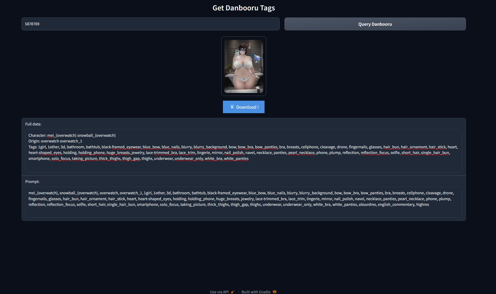

# Get Danbooru Tags - Web UI



A minimal Gradio-based web app that lets you **input a Danbooru image ID** and quickly retrieve:
- Character tags  
- Copyright/origin  
- General + meta tags  
- Prompt-ready output  
- A preview image  
- Direct link to full-resolution image download  


---

## 🧠 What is This?

This is a simple web UI built using Python and Gradio to fetch tags and metadata from [Danbooru](https://danbooru.donmai.us) by providing an image/video ID. It helps AI image creators and prompt engineers easily get structured data and reference images for generating text-to-image prompts.

---

## 📦 Requirements

Make sure you have Python 3.9 or newer installed.

Install dependencies with:

```bash
pip install gradio requests
```

---

## ⚙️ Installation & Running

### 🪟 Windows

Simply run:

```bash
start.bat
```

This will launch the Gradio UI in your browser.

---

### 🍎 macOS / 🐧 Linux

In your terminal, run:

```bash
python3 app.py
```

If that doesn't work, try:

```bash
python app.py
```

Alternatively, you can create a startup shell script:

```bash
#!/bin/bash
python3 app.py
```

Save it as `start.sh`, then make it executable:

```bash
chmod +x start.sh
./start.sh
```

---

## 🚧 Limitation

This tool **relies entirely on Danbooru's live API**. If Danbooru is:
- Down  
- Returning errors  
- The post ID is private or deleted  

...then this script won't be able to fetch anything. There's no offline fallback or local tag database.

---

## 📖 How to Use

1. Start the app (see instructions above).
2. Enter a valid Danbooru image ID (like `1234567`) in the input field.
3. Click **"Query Danbooru"**.
4. The app will display:
   - Character + copyright
   - Prompt-ready tags
   - Preview image
   - One-click download button for full-size image

You can copy the tags into your AI prompt workflow directly.

---

## ❤️ Credits

This project is a **fork** of [shirooo39/get-danbooru-tags](https://github.com/shirooo39/get-danbooru-tags), which was originally a CLI tool. This version adds a user-friendly web interface using Gradio and provides preview and option to download full size image/video.

---
